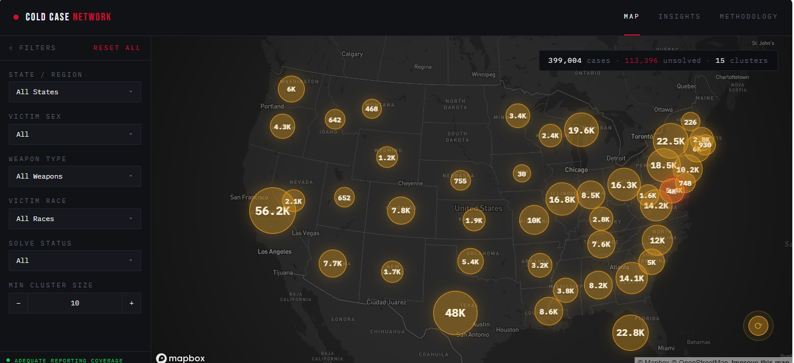

# Cold Case Network

> A geographic intelligence tool that surfaces unsolved homicide clusters from FBI data, built for investigative journalists, true crime producers, and cold case units.



**Live:** [cold-case-lite.vercel.app](https://cold-case-lite.vercel.app)

---

## The Problem

894,636 homicide records sit in a public FBI dataset spanning 1976 to 2023. About a third were never solved. When a serial offender operates across county or state lines, no single agency has visibility into the full pattern. Cases that should be connected remain isolated in separate databases. Investigative journalists do this cross-referencing manually, spending weeks on a single geographic analysis.

## What It Does

Cold Case Network ingests FBI Supplementary Homicide Report data, groups cases by geography and MO, and surfaces clusters of unsolved homicides on an interactive map. Users apply filters (state, victim sex, weapon type, race, solve status) and watch patterns emerge in real time. Clicking a cluster opens an Investigative Case File with a generated story brief, victim profile breakdowns, and a scrollable case table.

## Key Features

| Feature | What It Does |
|---------|-------------|
| Interactive cluster map | State-level national overview with county-level drill-in. Markers sized by case count, color-coded by solve rate. |
| Filter-driven exploration | Narrow 399,004 records by state, victim sex, weapon, race, and solve status. Map and stats update live. |
| Investigative Case File | Click any cluster for a detail panel with case breakdowns, a generated story brief, and individual case rows. |
| Data reliability audit | Flags low-reporting states (Mississippi 24%, Florida 48%) so users know where to trust the data and where to be skeptical. |
| Insights dashboard | Surfaces structural findings: racial solve rate gap (0.3pp in the 1980s to 17.8pp in the 2010s), jurisdictional accountability, national trends. |

## Tech Stack

| Layer | Technology | Why |
|-------|-----------|-----|
| Frontend | Next.js 16, TypeScript | App Router with static prerendering for fast initial load. TypeScript enforces the data contract across 30-column case records. |
| Styling | Tailwind CSS v4 | Design token system via @theme directive maps directly to the dark intelligence dashboard aesthetic. No CSS modules, no style conflicts. |
| State | Zustand | Two independent stores (filters, map) that never cross-contaminate. No Redux boilerplate for what are essentially two slices. |
| Map | Mapbox GL JS | Dark basemap, GeoJSON state boundaries, programmatic flyTo for state zoom. Only serious map library that handles 1,400+ markers without choking. |
| Database | Supabase (PostgreSQL) | Free tier handles 399K rows. REST API with row-level filtering means the frontend queries directly, no custom backend needed. |
| Deployment | Vercel | Zero-config Next.js deploys. Environment variables set before first deploy per lessons from prior projects. |

## Architecture

```
User → Landing Page → Map View → Supabase REST API → PostgreSQL (399K records)
                         ↓                ↓
                   Mapbox GL JS     national-clusters.json
                  (dark basemap)    (pre-computed state aggregates
                                     for instant initial load)
```

## Technical Decisions

**Pre-computed national view over live aggregation:**
The national map loads a static JSON of state-level aggregates instead of querying 399K rows on every page load. Filters switch to live Supabase queries. This gives instant initial render while keeping filtered exploration real-time.

**State-level bubbles with county drill-in:**
Rendering 1,400 county markers nationally made the map unreadable. State-level bubbles on the default view give geographic context at a glance. Selecting a state triggers a Supabase query scoped to that state and renders county-level markers. The audience sees the national scale first, then watches the pattern emerge as filters narrow.

**Unsolved threshold tuned to 0.50 over the spec's 0.33:**
The original cluster formula (solve rate <= 33%) produced zero clusters for the Green River Killer demo scenario because King County's strangulation cases sit at 57% unsolved. Loosening to 50% surfaces the 3-county pattern (King, Pierce, Spokane) that makes the demo work. The threshold is a named constant, tunable in one line.

## Getting Started

### Prerequisites
- Node.js 18+
- Supabase account (free tier)
- Mapbox account (free tier)

### Installation
```bash
git clone https://github.com/jonelrichardson-spec/cold-case-lite.git
cd cold-case-lite
npm install
```

### Environment Variables
Create a `.env.local` file:
```
NEXT_PUBLIC_SUPABASE_URL=your_supabase_url
NEXT_PUBLIC_SUPABASE_ANON_KEY=your_supabase_anon_key
NEXT_PUBLIC_MAPBOX_TOKEN=your_mapbox_token
```

### Run Locally
```bash
npm run dev
# Open http://localhost:3000
```

## What I'd Build Next

- Supabase RPC for server-side county aggregation, replacing the client-side clustering and removing the 25K fetch cap for unfiltered state queries
- Full 1976-2023 dataset with a date range slider, enabling decade-by-decade pattern exploration
- PDF export for the Investigative Case File panel, giving journalists a downloadable brief they can take to editorial meetings

## About This Project

Built as a capstone project for the Pursuit AI-Native Builder Fellowship (September 2025 to May 2026). Cold Case Network was originally built with Manny (backend/data engineering). I owned the full frontend: map, filters, cluster visualization, detail panel, and all UI. For this demo build, I rebuilt the app solo on a new stack to hit a 3-minute live presentation, handling the data pipeline and deployment in addition to frontend.

**My role**: Frontend lead. Solo rebuild for demo deployment, including data pipeline and Supabase setup.

---

Built by [Jonel Richardson](https://linkedin.com/in/jonel-richardson-09a399382)
